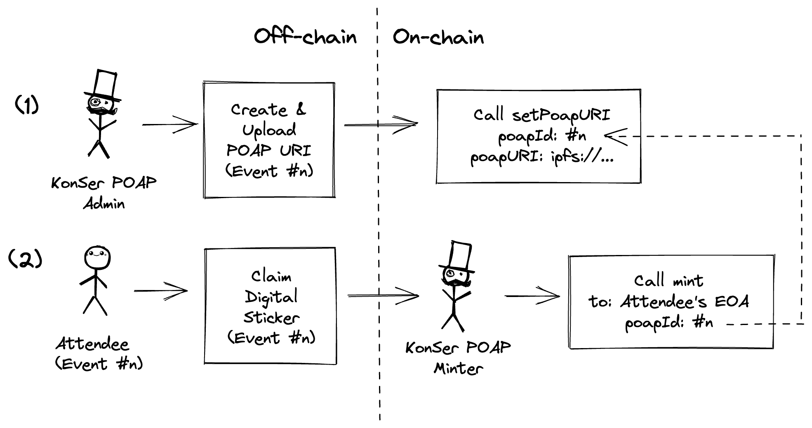

# KonSer POAP Contracts

## About The Project
This repository is a collection of smart contracts and unit-testing scripts for [KonSer.co.id](https://www.konser.co.id/) [POAP](https://pixelplex.io/blog/what-is-poap/) distribution and management.

KonSer is an online ticketing platform by [SerMorpheus](https://techcrunch.com/2022/09/23/sermorpheus-nft-crypto-indonesia/), where the attendee of an event would be granted to free claim its event's POAP.

## Schema

1. Before every claimable POAPs, KonSer POAP admin must store non-empty string NFT metadata and map it to the index of poapId in the contract by calling `setPoapURI(uint256 poapId, string memory poapURI)`.

2. Attendee (event #n) claims the digital sticker in KonSer app will send a request to KonSer POAP minter to call `mint(address to, uint256 poapId)` for 1 (one) quantity of tokenId (from poapId #n) to the attendee's EOA.

## Deployment method
The contracts deployment method is using UUPS [proxy-upgradeable pattern](https://docs.openzeppelin.com/upgrades-plugins/1.x/proxies).

## Finalized Deployment
Contracts (proxy and its implementation) are deployed on the [Polygon PoS](https://polygon.technology/polygon-pos) Mainnet.

| Contracts           | Address                                                                                                                  |
|---------------------|--------------------------------------------------------------------------------------------------------------------------|
| Implementation (v1) | [0x2DaEa810206d6C4104A49fd4F01e23064AC7b7BE](https://polygonscan.com/address/0x2daea810206d6c4104a49fd4f01e23064ac7b7be) |
| ERC1967 Proxy       | [0x5D1473dDFacB856FAfE2051e92Be7BDA564F28F7](https://polygonscan.com/address/0x5d1473ddfacb856fafe2051e92be7bda564f28f7) |

## Notes
The contracts had NOT been audited but passed the [unit-testings](https://github.com/mfer8023/konser-poap-contracts/tree/main/test).
